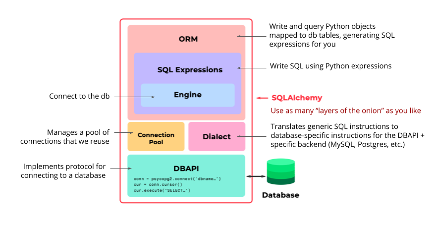

# Udacity Full Stack Development Nanodegree

This is the repo for data modeling of Udacity's Full Stack Development Nanodegree

---

## SQL Review

[SQL Fiddle of Drivers and Vehicles](http://sqlfiddle.com/#!17/a114f/2)

### Joins & Group Bys

1. Select all vehicles owned by driver with name 'Sarah' (without knowing their ID).

```sql
SELECT * FROM vehicles JOIN drivers USING(id) WHERE drivers.first_name = 'Sarah';
```

2. Show a table of the number of vehicles owned per driver.

```sql
SELECT * FROM drivers JOIN (SELECT id, COUNT(*) AS count FROM vehicles GROUP BY id) AS stats USING(id);
``` 

3. Show the number of drivers that own a Nissan model.

```sql
SELECT COUNT(DISTINCT driver_id) FROM vehicles WHERE make = 'Nissan';
```

### Structuring Data

1. Update all existing vehicle records to have a vehicle color.

```sql
ALTER TABLE vehicles 
ADD COLUMN color VARCHAR;

UPDATE vehicles
SET color = 'Red'
WHERE
   ID = 1;
 
UPDATE vehicles
SET color = 'Black'
WHERE
   ID = 2;
 
UPDATE vehicles
SET color = 'Black'
WHERE
   ID = 3;

UPDATE vehicles
SET color = 'Red'
WHERE
   ID = 4;

ALTER TABLE vehicles
ALTER COLUMN color SET NOT NULL;
```

### Query Optimization

```sql
EXPLAIN analyze SELECT first_name, last_name, make FROM vehicles JOIN drivers ON vehicles.driver_id = drivers.id;
```

```bash
                                                   QUERY PLAN                                                    
-----------------------------------------------------------------------------------------------------------------
 Hash Join  (cost=29.12..46.84 rows=610 width=96) (actual time=0.054..0.060 rows=4 loops=1)
   Hash Cond: (vehicles.driver_id = drivers.id)
   ->  Seq Scan on vehicles  (cost=0.00..16.10 rows=610 width=36) (actual time=0.015..0.017 rows=4 loops=1)
   ->  Hash  (cost=18.50..18.50 rows=850 width=68) (actual time=0.024..0.025 rows=4 loops=1)
         Buckets: 1024  Batches: 1  Memory Usage: 9kB
         ->  Seq Scan on drivers  (cost=0.00..18.50 rows=850 width=68) (actual time=0.009..0.014 rows=4 loops=1)
 Planning Time: 0.240 ms
 Execution Time: 0.108 ms
(8 rows)

```

---

## Network

[14 of the most common ports](https://opensource.com/article/18/10/common-network-ports)

---

## Database Service

### General

* Databases are interacted using client-server interactions, over a network
* Postgres uses TCP/IP to be interacted with, which is connection-based
* We interact with databases like Postgres during sessions
* Sessions have transactions that commit work to the database

### Transactions

An atomic unit of work for the database to perform as a whole.

* Single or Multiple Changes

* Executed in an Ordered Way

* All Succeed or All Failed as a Unit

### Building

Add one or more **UPDATE, INSERT DELETE** in sequence. Schema change doesn't belong to transaction.
```python
transaction.add("UPDATE vehicles SET color = 'Red' WHERE id = 1")
```

Then
```python
transaction.commit()
```

Or clear
```python
transaction.rollback()
```

---

## Postgres

### psql

An interactive terminal application for connecting and interacting with your local postgres server on your machine.

### Meta-Commands

```bash
# establish connection:
psql <dbname> [<username>]
```

|  Meta-Command  |                               Description                              |
|:--------------:|:----------------------------------------------------------------------:|
|       \l       | List all databases on the server, their owners, and user access levels |
|   \c <dbname>  |                      Connect to the given database                     |
|       \dt      |                          Show database tables                          |
| \d <tablename> |                          Describe table schema                         |
|       \q       |                    Quit psql, return to the terminal                   |

### Other Clients

[pgAdmin](https://www.pgadmin.org/)

---

## SQLAlchemy

### Overview

Multiple levels of abstraction you can prefer, between **the database driver** and **the ORM**

* **Python Database Adaptor** psycopg2
* **ORM** maps tables and columns to objects and attributes

### Advantages

* Working entirely in Object-Oriented Python rather than raw PGSQL.

* Easy switch between different database systems.

### Architecture



* **Dialect** How to talk to a specific kind of database/DBAPI implementation.
* **Connection Pool** Better DB connection management
    * Avoid opening & closing connections for every DB change
    * Handle connection drop caused by network issues decently
* **Engine**
    * Can be used to talk directly with database like using DBAPI
    * Or can be used to support ORM
    ```python
    from sqlalchemy import create_engine

    engine = create_engine('postgresql://udacity:udacity@db:5432/todoapp')
    conn = engine.connect()

    result = conn.execute(
       '''
       SELECT * FROM vehicles
       '''
    )

    result.close()
    ```
* **SQL Expressions**
    * Composing SQL statements using Python objects.
* **ORM**
    * Table Schema to Class Definition
    * Table Columns to Class Attributes
    * Rows to Class Instances / Objects

### Connection Specification


---

## Flask-SQLAlchemy


---