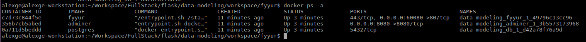
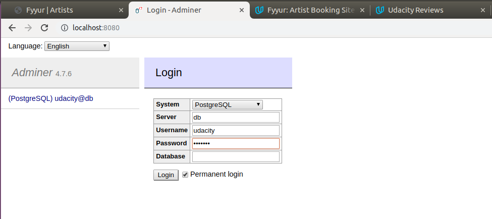
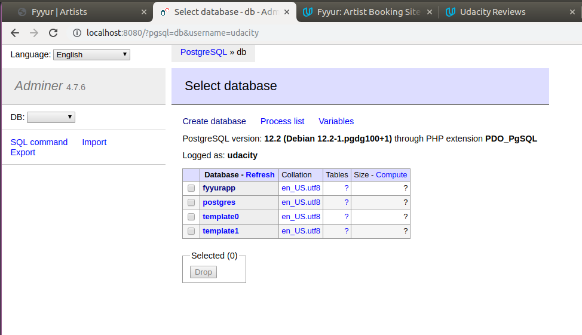
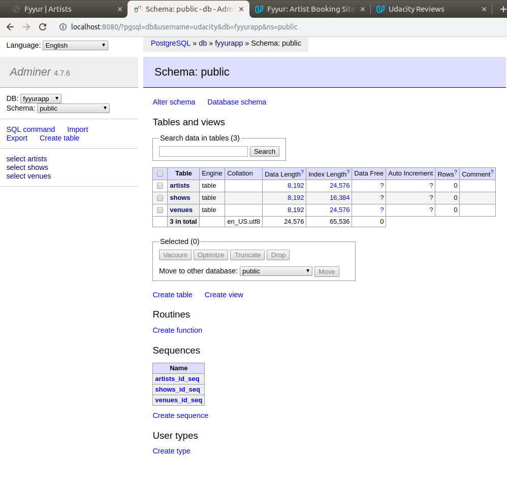

# Udacity Full Stack Development Nanodegree

This is the project for data modeling of Udacity's Full Stack Development Nanodegree

---

## Up & Running

### Deploy

First, make a folder called **volume** for PostgresSQL Docker's storage on local filesystem:
```bash
mkdir volume
```

Then, build docker images by:
```bash
docker-compose build
```

Make sure the following ports on your host are not pre-occupied, then type:
* **60080** to be used by Fyyur App
* **8080** to be used by PGSQL adminer

```bash
docker-compose up
```

### Insert Init Data

Next let's pop db with initial data. Use the following command to identify Fyyur App instance:
```bash
docker ps -a
```

Select the Docker instance with fyyur inside its name:


Use the following command to enter it:
```bash
docker exec -it [FYYUR_APP_DOCKER_INSTANCE] bash
```

Inside it launch Flask shell
```bash
flask shell
```

Use the following python statement to init all the data:
```python
from init_db import init_all; init_all(db, Artist, Show, Venue)
```

### Verify DB Status

Finally, go to http://localhost:8080 to verify all the data are inside







---

## Data Models

### Implement Data Models in Relational, Normalized Form

The three data models are implemented inside <a href="workspace/fyyur/application/models.py">here</a>
The migration is available inside <a href="workspace/fyyur/migrations">here</a>

### Connect Data Models to a Database

The DB connection is specified in <a href="workspace/fyyur/config.py">here</a>

### Demonstrate a Good Grasp of Database Normalization

The three data models are implemented inside <a href="workspace/fyyur/application/models.py">here</a>
The migration is available inside <a href="workspace/fyyur/migrations">here</a>

### Demonstrate a Good Grasp of SQLAlchemy

The queries used for artist views are inside <a href="workspace/fyyur/application/artist/views.py">here</a>
The queries used for venues views are inside <a href="workspace/fyyur/application/venue/views.py">here</a>
The queries used for shows views are inside <a href="workspace/fyyur/application/show/views.py">here</a>

---

## SQL

### Use SQL Syntax to Select Records from a Database

Here one query from artist view is used as example for **SELECT**. The queries used for artist views are inside <a href="workspace/fyyur/application/artist/views.py">here</a>
```python
#  READ
#  ----------------------------------------------------------------
@bp.route('/', methods=['GET'])
def artists():
    """ list all artists
    """
    # data:
    shows_subq = Show.query.with_entities(
        Show.artist_id,
        func.count(Show.artist_id).label('num_upcoming_shows')
    ).filter(
        Show.start_time > datetime.utcnow()
    ).group_by(
        Show.artist_id
    ).subquery()

    data = db.session.query(
        Artist.id,
        Artist.name,
        shows_subq.c.num_upcoming_shows
    ).join(
        shows_subq, Artist.id == shows_subq.c.artist_id
    ).all()

    artists=[
        {
            "id": id,
            "name": name,
            "num_upcoming_shows": num_upcoming_shows
        } for (id, name, num_upcoming_shows) in data
    ]
    
    return render_template('pages/artists.html', artists=artists)
```

### Use SQL Syntax and SQLAlchemy to Join Relational Tables and Conduct Joined Queries

Here one query from show view is used as example for **JOIN**. The queries used for show views are inside <a href="workspace/fyyur/application/show/views.py">here</a>

```python
#  READ
#  ----------------------------------------------------------------
@bp.route('/')
def shows():
    ''' list shows
    '''
    # artists:
    artists_subq = Artist.query.with_entities(
        Artist.id,
        Artist.name,
        Artist.image_link
    ).subquery()
    # venues:
    venues_subq = Venue.query.with_entities(
        Venue.id,
        Venue.name,
        Venue.image_link
    ).subquery()
    # shows:
    shows_subq = Show.query.with_entities(
        Show.start_time,
        Show.artist_id,
        Show.venue_id
    ).subquery()
    
    # join
    data = db.session.query(
        venues_subq.c.id,
        venues_subq.c.name,
        artists_subq.c.id,
        artists_subq.c.name,
        artists_subq.c.image_link,
        shows_subq.c.start_time
    ).join(
        artists_subq, shows_subq.c.artist_id == artists_subq.c.id
    ).join(
        venues_subq, shows_subq.c.venue_id == venues_subq.c.id 
    ).all()

    # format:
    shows = [
        {
            "venue_id": venue_id,
            "venue_name": venue_name,
            "artist_id": artist_id,
            "artist_name": artist_name,
            "artist_image_link": artist_image_link,
            "start_time": start_time.strftime("%Y-%m-%dT%H:%M:%S.%fZ")
        } for (venue_id, venue_name, artist_id, artist_name, artist_image_link, start_time) in data
    ]

    return render_template('pages/shows.html', shows=shows)
```

### Use SQL to Create Records with Uniqueness Constraints

Here one query from show view is used as example for **INSERT INTO**. The queries used for show views are inside <a href="workspace/fyyur/application/show/views.py">here</a>

```python
@bp.route('/create', methods=['POST'])
def create_show_submission():
    """ create new venue using POSTed form
    """
    # parse POSTed form:
    show_created = convert_form_dict_to_dict(request.form)

    try:
        show = Show(**show_created)
        db.session.add(show)
        db.session.commit()
        # on successful db insert, flash success
        flash('Show was successfully listed!')
    except:
        db.session.rollback()
        # on unsuccessful db insert, flash an error instead.
        flash('An error occurred. Your show could not be listed.')
    finally:
        db.session.close()

    return render_template('pages/home.html')
```

---

## Application Quality & Deployment

### Demonstrate the Ability to Construct a Well-Organized Code Base

The whole project follows the structure recommended by [Flask Mega Tutorial by Miguel Grinberg](https://blog.miguelgrinberg.com/post/the-flask-mega-tutorial-part-xv-a-better-application-structure)

### Create a Web APP that Builds Successfully and Runs Without Errors

Follow the instruction in section **Up & Running** to build and deploy the APP.